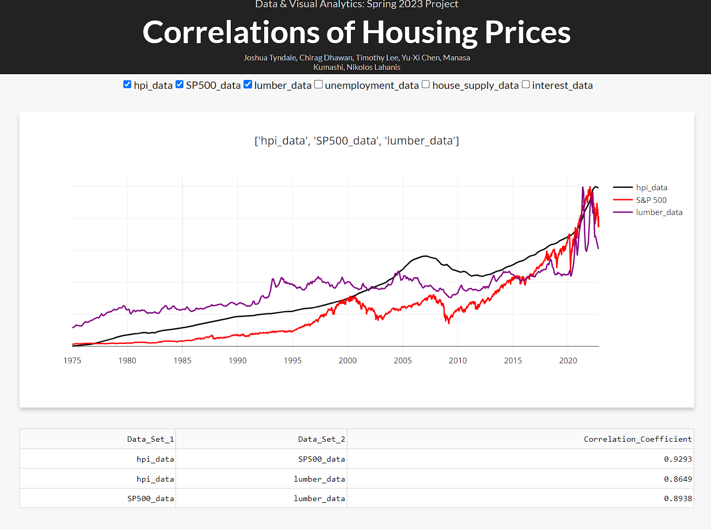
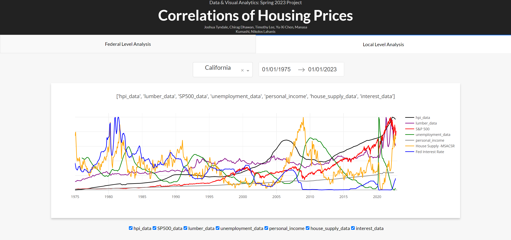

# Housing Market Analysis

**What drives U.S. home prices, and where are they headed?**

An interactive dashboard that combines nearly 50 years of national and state-level economic data (1975–2022) to measure how macroeconomic indicators move with the Housing Price Index (HPI). It also forecasts home prices through 2030.


*Federal Level Analysis tab: pick indicators and a date range to compare them with the HPI. The dashed line is the ARIMA forecast to 2030.*

---

## Key Findings

Pearson correlation with the national Housing Price Index, using monthly data from January 1975 to October 2022:

| Indicator | Correlation with HPI |
|---|---:|
| S&P 500 | **0.93** |
| Lumber prices | **0.86** |
| Personal savings rate | **−0.86** |
| Federal funds interest rate | **−0.72** |
| Consumer Price Index | 0.71 |
| Labor force participation | 0.69 |
| Rental vacancy rate | 0.40 |
| Unemployment rate | −0.37 |
| Supply of new houses | −0.08 |

- **Equity markets and construction costs move most closely with home prices.** The S&P 500 and lumber prices are the two strongest positive correlates.
- **Interest rates and the savings rate move against home prices.** Both fell over the period while home prices rose.
- **Housing supply alone barely tracks prices** (r ≈ −0.08), even though supply is often cited as the main driver.

> These are correlations between long-run trending series, not causal effects. See [Limitations](#limitations--next-steps).

---

## Approach

### 1. Data collection and preprocessing
- Collected **250+ datasets** from FRED, the Bureau of Labor Statistics and Yahoo Finance. These include 12 national indicators and 5 state-level indicators for all 50 states plus DC.
- Brought daily, monthly and quarterly series to a common **monthly grain**: daily S&P 500 prices averaged per month, quarterly HPI and vacancy data forward-filled.
- Normalized each series so indicators with very different units can be compared on one chart.

### 2. Exploratory and statistical analysis
- Computed correlation coefficients between the HPI and each indicator, recalculated for the indicators the user selects in the dashboard.
- Fit a **scikit-learn linear regression** that ranks the selected indicators as predictors of the HPI.

### 3. Forecasting
- Built **ARIMA(2,1,2)** time-series models (statsmodels) that forecast the national HPI through 2030 ([`model.py`](model.py)).
- Extended the same approach to **state-level forecasts for every state** in [`ARIMA/ARIMA_POC.ipynb`](ARIMA/ARIMA_POC.ipynb).

### 4. Interactive dashboard
- A **Plotly Dash** app with two views:
  - **Federal Level Analysis:** indicator checkboxes, date-range filter, HPI forecast, regression feature ranking and a live correlation table.
  - **Local Level Analysis:** choose a state to compare its HPI with state and national indicators.


*Local Level Analysis tab: state HPI (California shown) plotted against unemployment, personal income, housing supply, interest rates and more.*

---

## Tech Stack

**Python** · **pandas** · **NumPy** · **statsmodels** (ARIMA) · **scikit-learn** · **Plotly Dash** · **Matplotlib**

---

## Repository Structure

```
Housing_Market_Analysis/
├── dash_backend.py        # Dash app: layout, callbacks, charts
├── data_manager.py        # Data loading, cleaning, resampling, correlation analysis
├── model.py               # Linear regression feature ranking + ARIMA forecasting
├── requirements.txt       # Python dependencies
├── assets/style.css       # Dashboard styling
├── ARIMA/
│   ├── ARIMA_POC.ipynb    # State-by-state ARIMA forecasts
│   └── HPI_State.csv
└── data/
    ├── Federal/           # National indicators (HPI, S&P 500, Fed funds, CPI, lumber, ...)
    └── State/             # Per-state HPI, unemployment, permits, rental vacancy, min wage, income
```

---

## Running Locally

Requires **Python 3.10+**.

```bash
git clone https://github.com/jtyndale9/Housing_Market_Analysis.git
cd Housing_Market_Analysis

python -m venv venv
source venv/bin/activate        # Windows: venv\Scripts\activate

pip install -r requirements.txt
python dash_backend.py
```

Then open **http://localhost:8000** in your browser.

---

## Data Sources

| Dataset | Source |
|---|---|
| House Price Index (national and state) | [FRED – USSTHPI](https://fred.stlouisfed.org/series/USSTHPI) |
| Federal funds rate | [FRED – FEDFUNDS](https://fred.stlouisfed.org/series/FEDFUNDS) |
| Unemployment rate | [BLS – LNS14000000](https://beta.bls.gov/dataViewer/view/timeseries/LNS14000000) |
| S&P 500 | [Yahoo Finance – ^GSPC](https://finance.yahoo.com/quote/%5EGSPC/history/) |
| Lumber prices (PPI) | [FRED – WPU081](https://fred.stlouisfed.org/series/WPU081) |
| Monthly supply of new houses | [FRED – MSACSR](https://fred.stlouisfed.org/series/MSACSR) |
| Consumer Price Index | [FRED – CPIAUCSL](https://fred.stlouisfed.org/series/CPIAUCSL) |
| Personal savings rate | [FRED – PSAVERT](https://fred.stlouisfed.org/series/PSAVERT) |
| Labor force participation | [FRED – CIVPART](https://fred.stlouisfed.org/series/CIVPART) |
| Rental vacancy rate | [FRED – RRVRUSQ156N](https://fred.stlouisfed.org/series/RRVRUSQ156N) |
| Rent prices (CPI: rent of primary residence) | [FRED – CUSR0000SEHA](https://fred.stlouisfed.org/series/CUSR0000SEHA) |
| State permits, vacancy, minimum wage, unemployment, income | [FRED](https://fred.stlouisfed.org/) (per-state series) |

---

## Limitations & Next Steps

- **Correlation ≠ causation.** Most of these series trend upward over time, which inflates correlations between raw levels. A next step is to correlate period-over-period changes (differenced series) and to test for Granger causality.
- **No forecast backtesting yet.** The ARIMA order (2,1,2) was fixed rather than tuned. Next steps: hold out recent years as a test set, report MAPE or RMSE, and choose the order by AIC.
- **Univariate forecasts.** The ARIMA model uses only past HPI values. A SARIMAX or gradient-boosted model could add the economic indicators above as external predictors.
- **Missing-data handling.** Gaps in some series (building permits, early rent data) are padded with placeholder values. Proper imputation would make those correlations more reliable, so they are left out of the findings above.

---

## Team

Built as a team project for **Data & Visual Analytics (Spring 2023)** by Joshua Tyndale, Chirag Dhawan, Timothy Lee, Yu-Xi Chen, Manasa Kumashi and Nikolos Lahanis.
